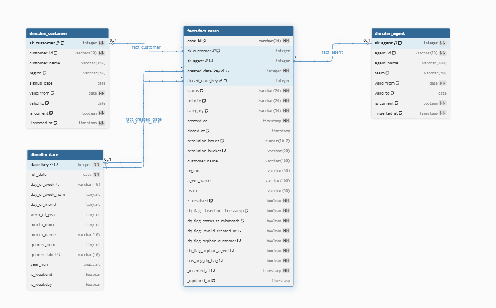

# Customer Support Analytics Pipeline


An end-to-end analytics engineering case study: three raw CSV files are turned into a
clean, analytics-ready **star schema** on **Snowflake**, ready for a BI tool (Power BI /
Tableau) to sit on top of. Built as a Senior Data Architect interview exercise.

📘 **Preparing for an interview with this?** Start with
**[INTERVIEW_PREP.md](INTERVIEW_PREP.md)** — a self-contained study guide (pitch, walkthrough
script, design-decision defenses, and a question bank).

> **The brief:** A company runs a customer support platform. Customers raise support
> tickets ("cases"), agents work them, and leadership wants dashboards answering:
> *How long do cases take to resolve? Which regions generate the most cases? Which agents
> perform best? Are Urgent cases actually resolved faster than Low-priority ones?*
>
> We were handed **3 raw CSVs — 200 cases, 150 customers, 40 agents** — and asked to design
> and build the pipeline that makes that data trustworthy and query-ready.

---

## Architecture

```
CSV files  ─▶  RAW  ─▶  STAGING  ─▶  DIMENSIONS  ─▶  FACT TABLE  ─▶  BI / Analytics
              (land)   (parse +      (clean          (one analytics-
                        DQ flags)     lookups)         ready row/case)
```

| Layer | Single responsibility |
|-------|----------------------|
| **Raw** | Minimally transformed landing layer. Fields stay `VARCHAR`; ingestion metadata (`_loaded_at`, `_source_file`) is added, empty values are standardised to `NULL`, and spaces trimmed. Designed to tolerate source-format issues (`ON_ERROR = 'CONTINUE'`) without failing the whole batch. |
| **Staging** | Parse types, normalise values, compute resolution time + the DQ flags. |
| **Dimensions** | Clean lookup tables — `dim_customer`, `dim_agent`, `dim_date` (SCD2 columns present, see below). |
| **Fact** | One analytics-ready row per case. No joins needed for the common queries. |

Each layer has one job and can evolve independently in production.

### Data model — star schema



```
              dim_date
                 │
  dim_customer ─ fact_cases ─ dim_agent
```

- **Grain:** one row per case — `case_id` is the business key for the fact.
- **Why a star schema?** A star schema fits this exercise: a small number of stable source
  files and a read-heavy BI workload, which Snowflake's columnar storage and Power BI both
  handle well. A Data Vault layer would add modelling and operational complexity without
  enough benefit at this scope. A highly normalised 3NF model would preserve source
  relationships well but require more joins for the BI questions here, so a star schema is
  simpler for analytical consumption.
- **`dim_date` is a role-playing dimension** — the fact carries both `created_date_key` and
  `closed_date_key`, so the *same* date dimension is joined twice (once as "created", once as
  "closed"). That's why the diagram shows two links into `dim_date`.

---

## Repository structure

```
.
├── All_SQL/                      # The pipeline, in run order
│   ├── 01_CSV_to_RAW.sql         # Schemas, raw tables, file format, COPY INTO
│   ├── 02_Staging_Layer.sql      # Type parsing, normalisation, resolution time, DQ flags
│   ├── 03_Dim_layer.sql          # dim_customer, dim_agent, dim_date (SCD2 columns)
│   ├── 04_Analytics_layer.sql    # fact_cases MERGE + post-load validation checks
│   └── 05_Analytics_query.sql    # Business questions answered against the fact table
├── Data_Set/                     # Source data
│   ├── cases.csv                 # 200 rows
│   ├── customers.csv             # 150 rows
│   └── agents.csv                # 40 rows
├── Data_Model.png                # Star-schema diagram
├── Case_Study_Presentation_PPT.pptx
├── verify_metrics.py             # Reproduces every headline number from the CSVs
├── INTERVIEW_PREP.md             # Self-contained interview prep module (start here)
├── presentation_reference.md     # Original talking-points / speaker notes
├── LICENSE                       # MIT
└── README.md
```

> **Preparing for the interview?** Read [`INTERVIEW_PREP.md`](INTERVIEW_PREP.md) — it's a
> self-contained study guide: the elevator pitch, a walkthrough script, a bank of likely
> questions with strong answers, and the numbers to memorise.

---

## Source data

**`cases.csv`** (200 rows)

| Column | Type | Notes |
|--------|------|-------|
| `case_id` | String | Unique, e.g. `C0001` |
| `created_at` | String | ISO timestamp — needs parsing |
| `closed_at` | String | Empty for open cases — a key data-quality source |
| `customer_id` | String | FK → customers |
| `agent_id` | String | FK → agents |
| `category` | String | Technical / Account / Billing / Other |
| `priority` | String | Low / Medium / High / Urgent |
| `status` | String | Open / Closed / In Progress / On Hold |

**`customers.csv`** (150 rows) — `customer_id`, `customer_name`, `region` (APAC / LATAM /
Europe / North America), `signup_date`.

**`agents.csv`** (40 rows) — `agent_id`, `agent_name`, `team` (Billing / Tier 1 / Tier 2 /
Escalations).

---

## Data quality — profiled before writing any SQL

> *Profile the data before you design the pipeline. You never build on assumptions.*

| Issue | Rows | Decision |
|-------|-----:|----------|
| Closed status, but no `closed_at` | **9** | Flag. `resolution_hours = NULL`. Keep the row. |
| Open / On Hold / In Progress, but has a `closed_at` | **123** | Flag. **Status is the source of truth.** |
| Non-closed with `NULL closed_at` | 30 | Expected — no flag needed. |
| Orphan customer / agent (bad FK) | 0 | Check still runs every load. |

**Rule: flag dirty rows, never delete them.** Deleting hides the upstream bug; flagging
surfaces it. Flagged rows are loaded into the fact table and filtered *per metric*:

- **Resolution-time KPIs use clean records only** (`has_any_dq_flag = FALSE`, and a valid
  `resolution_hours`). A contradictory or incomplete timestamp can't be trusted to measure
  duration, so those rows are excluded.
- **Volume and status-based closure metrics use all cases**, because `status` is treated as
  the source of truth. A case counts toward volume and closure regardless of a stray
  timestamp — the timestamp problem is what the flag records, not the status.

Of 200 cases, **132 carry at least one DQ flag** and **68 are clean** — of which **38** are
resolved (Closed with a valid `closed_at`) and feed the resolution-time KPIs. Every number
in this README is reproducible with [`verify_metrics.py`](verify_metrics.py).

### DQ flags carried through to the fact table

| Flag | Count | Catches |
|------|------:|---------|
| `dq_flag_closed_no_timestamp` | 9 | Closed status with no close time |
| `dq_flag_status_ts_mismatch` | 123 | Status and timestamp contradict each other |
| `dq_flag_invalid_created_at` | 0 | `created_at` couldn't be parsed |
| `dq_flag_orphan_customer` | 0 | `customer_id` not in `dim_customer` |
| `dq_flag_orphan_agent` | 0 | `agent_id` not in `dim_agent` |
| **`has_any_dq_flag`** | **132** | Summary flag — filtered `FALSE` for resolution-time KPIs |

---

## Key design decisions

- **Surrogate keys** (`sk_customer`, `sk_agent`) instead of natural varchar keys — if source
  IDs get reused or changed, integer surrogates keep dimension joins stable.
- **Denormalised `region` and `team`** into the fact table — denormalising these frequently
  used attributes reduces joins for the main dashboard queries. Snowflake's columnar storage
  makes that trade-off practical for this workload.
- **`LEFT JOIN` in the fact MERGE, not `INNER JOIN`** — an inner join silently drops orphan
  rows; a left join keeps them and lets the DQ flag surface them.
- **Idempotent loading patterns throughout** — staging and the fact table use `MERGE`; the
  customer/agent SCD2 dimensions use expire-and-insert logic; the date dimension is generated
  deterministically with `CREATE OR REPLACE`. RAW loads with `COPY INTO`. Reruns don't
  duplicate rows.
- **Fixed step order** — `stg_customers` → `stg_agents` → `stg_cases` (cases left-join to
  both, so it runs last).
- **`TRY_TO_TIMESTAMP_NTZ`** — a bad timestamp becomes `NULL`, never a pipeline crash.
- **`EMPTY_FIELD_AS_NULL = TRUE`** — without it, an empty `closed_at` loads as `''` not
  `NULL`, and every DQ check silently breaks.
- **SCD2-ready dimensions** — `dim_customer` and `dim_agent` carry `valid_from` / `valid_to` /
  `is_current`, so they're structured to track history later **without a schema redesign**.
  The current load is a first-time insert and the fact joins only to `is_current = TRUE`, so
  full as-of historical tracking is *designed for*, not yet exercised.
- **Primary key is informational** — Snowflake standard tables don't enforce PK/unique
  constraints. `case_id` uniqueness in the fact is guaranteed by the `MERGE` keying on
  `case_id`, not by the engine.

---

## Key insights

| Finding | Value |
|---------|-------|
| Overall average resolution | **96.8 hours (~4 days)** — over 38 resolved clean cases |
| Fastest priority | High — **53.7 h** |
| Slowest priority | Low — **126.3 h** |
| ⚠️ Counterintuitive #1 | **Urgent (94.8 h) resolves slower than High (53.7 h)** → routing problem |
| ⚠️ Counterintuitive #2 | **Urgent has the *lowest* closure rate (14.6%)** of any priority |
| Best team | Tier 2 — **60.9 h** |
| Slowest team | Tier 1 — **147.6 h** (~2.4× slower → workload-design issue) |
| Highest volume region | LATAM — **62 cases** |
| Lowest closure rates | North America **18.4%**, LATAM **19.4%** |

The story isn't the averages — it's that **Urgent cases resolve *slower* than High and close
*least often***. That points at a triage/routing problem, not a capacity one. **Caveat:** only
38 resolved cases survive the DQ filter, so priority-level averages are directional, not
statistically significant — worth stating out loud in the interview.

### Reproduce every number

No Snowflake account needed — [`verify_metrics.py`](verify_metrics.py) mirrors the pipeline's
logic in plain Python and recomputes the figures straight from the CSVs. It applies the **same
population rules as the SQL**: the five DQ flags, resolution-time metrics on clean + resolved
rows only, and volume/closure on all cases. It independently reproduces the DQ-flag counts,
clean/resolved row counts, overall and by-priority/team average resolution, and region volume
and closure rates.

```console
$ python3 verify_metrics.py
Row counts        : cases=200  customers=150  agents=40

Data quality
  closed_no_timestamp : 9
  status_ts_mismatch  : 123
  has_any_dq_flag     : 132
  clean rows          : 68

Overall avg resolution: 96.8 h (~4.03 days) over 38 resolved clean cases

Avg resolution by priority (clean, resolved)
  Low        126.3 h   (n=9)
  Medium     113.5 h   (n=13)
  High        53.7 h   (n=11)
  Urgent      94.8 h   (n=5)
  ...
```

---

## How to run (Snowflake)

**Prerequisites**

- A Snowflake account and a running **warehouse** with rights to create schemas, tables, and
  file formats, and to load and query data.
- A database named **`DEMO_DB`**.
- A stage named **`@DEMO_DB.PUBLIC.CSV`** with the three CSVs uploaded:
  `agents.csv`, `customers.csv`, `cases.csv`.

**Execution context.** The scripts use partially qualified names (`stg.stg_cases`,
`dim.dim_customer`, `facts.fact_cases`), so each one begins with `USE DATABASE DEMO_DB;` to
avoid running in the wrong database. Set your warehouse (`USE WAREHOUSE <your_warehouse>;`)
before running.

Run the SQL files **in order**:

| Step | File | Does |
|------|------|------|
| 1 | `All_SQL/01_CSV_to_RAW.sql` | Creates `raw` / `stg` / `dim` / `facts` schemas, raw tables, file format, and `COPY INTO` loads. |
| 2 | `All_SQL/02_Staging_Layer.sql` | Parses types, normalises, computes `resolution_hours` and the DQ flags. |
| 3 | `All_SQL/03_Dim_layer.sql` | Builds `dim_customer`, `dim_agent`, and a 2020–2030 `dim_date`. |
| 4 | `All_SQL/04_Analytics_layer.sql` | MERGEs `fact_cases` and runs post-load validation. |
| 5 | `All_SQL/05_Analytics_query.sql` | The business-question queries. |

Then point Power BI / Tableau at `DEMO_DB.FACTS.FACT_CASES`.

### Expected validation results

Use these to confirm each step worked:

```text
RAW
  cases       200
  customers   150
  agents       40

STAGING
  DQ flagged  132
  clean        68

DIMENSIONS
  customers   150
  agents       40
  dates      4018

FACT
  cases                                              200
  clean resolved cases (used for resolution KPIs)     38
```

---

## Production & scale considerations

| Concern | Approach |
|---------|----------|
| Volume | Incremental `MERGE` keyed on an updated-at watermark; cluster the fact on `created_date_key`; Snowflake auto-scale. |
| Orchestration | Snowflake Tasks with the fixed step order; alert on the first failure. |
| Schema changes | Add columns as `NULLABLE` to RAW first; never drop without a deprecation window. |
| Monitoring | Track row counts, DQ-flag %, negative resolution hours, and orphan keys — alert *before* dashboards load. |
| History | Dimensions already carry SCD2 columns, so as-of historical tracking can be turned on without a schema redesign (the fact join would move from `is_current = TRUE` to a date-ranged lookup). |

---

## Design assumptions

- **`status` is the source of truth for closure-rate reporting.** When `status` and a
  timestamp disagree, `status` wins and the row is flagged.
- **A valid `resolution_hours` requires all of:** `status = 'Closed'`, a parseable
  `created_at`, a parseable `closed_at`, and `closed_at > created_at`. Anything else leaves
  `resolution_hours` NULL.
- **Dirty rows are preserved and flagged, not deleted** — so counts stay honest and the
  upstream problem stays visible.
- **Resolution-time KPIs exclude DQ-flagged rows**; volume and closure metrics do not.

Because only **38 clean resolved cases** feed the resolution-time KPIs, priority- and
team-level averages are **directional, not statistically significant** — worth saying out loud
rather than presenting them as firm conclusions.

---

## Future improvements

- **Two timestamp DQ flags not yet implemented** (both are 0 in this dataset, so nothing is
  hidden today): `dq_flag_invalid_closed_at` for a non-null `closed_at` that fails to parse,
  and `dq_flag_invalid_resolution_order` for `closed_at <= created_at`. Today the pipeline
  relies on `resolution_hours` being NULL in those cases rather than raising an explicit flag.
- **Automated tests.** The validation queries in `04_Analytics_layer.sql` are manual
  `SELECT`s; in production they'd be dbt/Snowflake tests that fail the build.
- **True incremental load** keyed on an updated-at watermark instead of a full reload.

---

## Tech stack

**Snowflake SQL** (MERGE, `TRY_TO_*`, `GENERATOR`/`SEQ4` date spine, window functions,
`QUALIFY`) · star-schema dimensional modelling · CSV → warehouse ingestion · BI-ready
output for Power BI / Tableau.

---

*Case study / interview exercise. Data is synthetic.*
